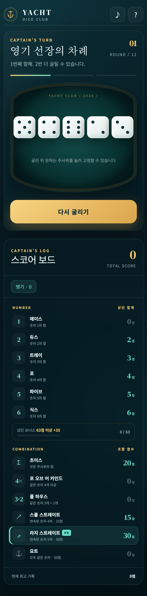

# YACHT — Dice Club

프리미엄 보드게임 스타일의 요트다이스 웹 게임입니다. 설치와 회원가입 없이 브라우저에서 바로 실행되며, 한 기기 로컬 플레이와 2~4인 실시간 온라인 플레이를 지원합니다.



## 바로 플레이

**https://kkyg1104-gif.github.io/yacht-dice/**

## 게임 모드

- **로컬 1~4인:** 한 기기에서 차례대로 플레이
- **온라인 2~4인:** 방장이 6자리 방 코드 또는 초대 링크를 공유하고 각자 기기에서 접속

## 온라인 플레이 방법

1. `새 게임` → `온라인 2~4인 플레이`를 선택합니다.
2. 방장은 이름을 입력하고 `새 방 만들기`를 누릅니다.
3. 초대 링크 또는 6자리 코드를 친구에게 보냅니다.
4. 참가자가 모두 입장하면 방장이 게임을 시작합니다.
5. 현재 차례인 플레이어만 굴리기, HOLD, 점수 선택을 조작할 수 있습니다.

## 기능

- 최대 3회 굴리기 및 주사위 HOLD
- 12개 요트다이스 점수 카테고리
- 상단 합계 63점 이상 보너스 +35점
- 예상 점수 및 추천 족보
- 실시간 턴·주사위·HOLD·점수 동기화
- 방장 권한형 게임 상태 검증
- 동일 브라우저 세션의 참가자 재접속
- 모바일·태블릿·PC 반응형 UI
- 사운드, 주사위 애니메이션, 축하 효과, 최종 순위

## 온라인 기술 구조

정적 프런트엔드는 GitHub Pages에서 제공하고, 참가자 간 데이터는 [Trystero](https://github.com/dmotz/trystero)와 WebRTC DataChannel을 통해 P2P로 전송합니다. 별도 게임 서버나 데이터베이스가 필요하지 않습니다.

- 방장 브라우저가 주사위 생성과 점수 확정을 담당합니다.
- 참가자 브라우저는 자신의 차례에 조작 의도만 방장에게 전송합니다.
- 방장이 상태를 검증한 뒤 모든 참가자에게 동기화합니다.

### P2P 방식의 한계

- 방장 브라우저가 닫히면 해당 온라인 게임도 종료됩니다.
- 회사·학교·일부 공공 Wi-Fi처럼 WebRTC가 차단된 네트워크에서는 연결이 어려울 수 있습니다.
- 안정적인 플레이를 위해 방장은 게임이 끝날 때까지 페이지를 유지해야 합니다.

## 로컬 실행

```bash
python3 -m http.server 8765
```

브라우저에서 `http://127.0.0.1:8765/`로 접속합니다.

## 검증

- 분리된 브라우저 세션 4개 동시 입장
- 방장 게임 시작 및 주사위 결과 4세션 일치
- 비현재 플레이어 입력 잠금
- 원격 참가자 굴림 요청 및 다음 턴 전환
- 모바일 Lighthouse: 접근성 100, 모범 사례 100
